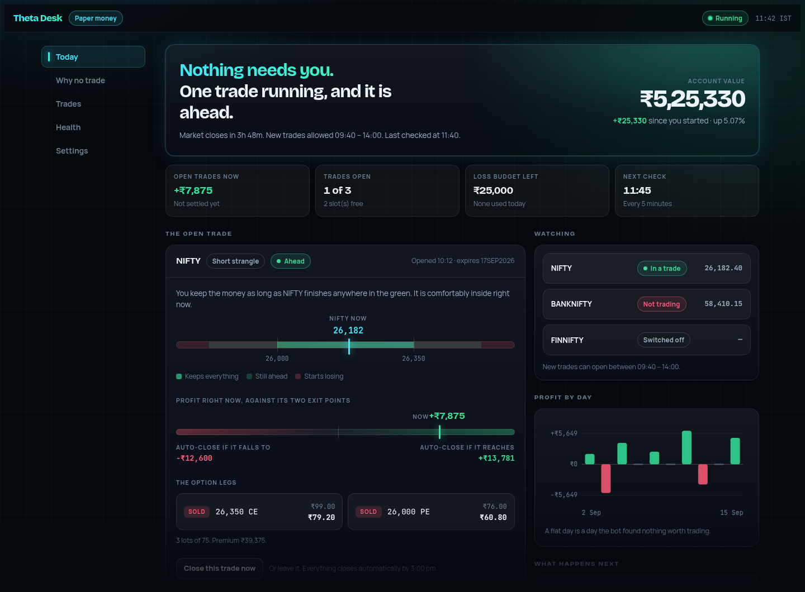
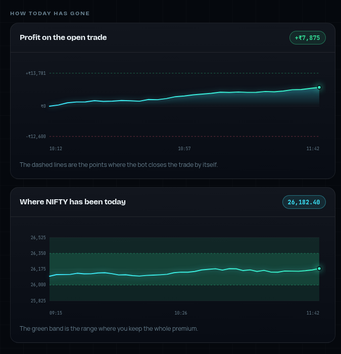
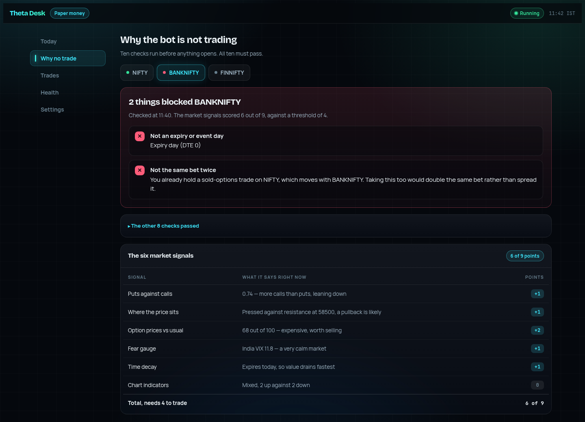
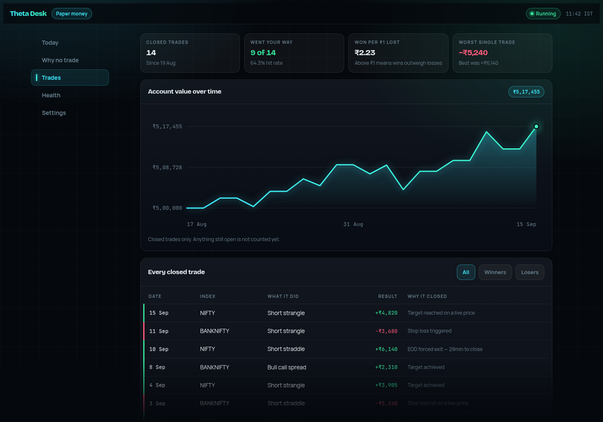
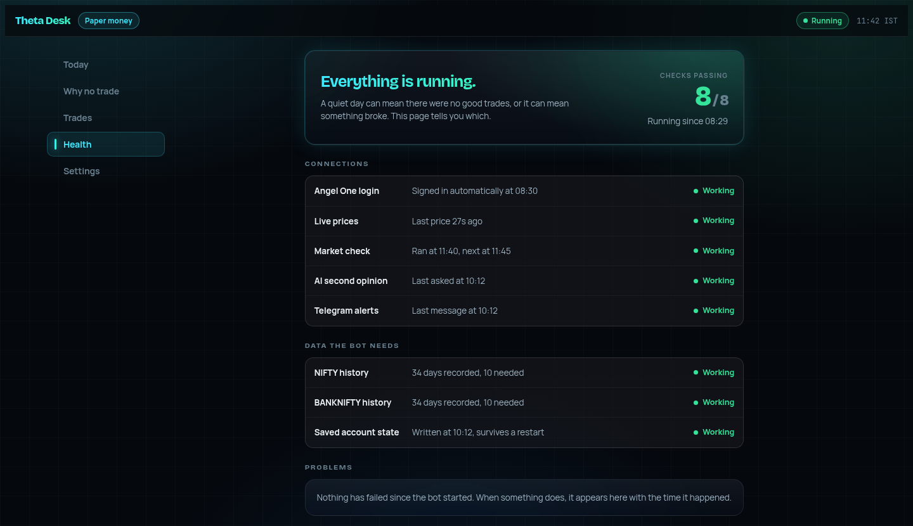
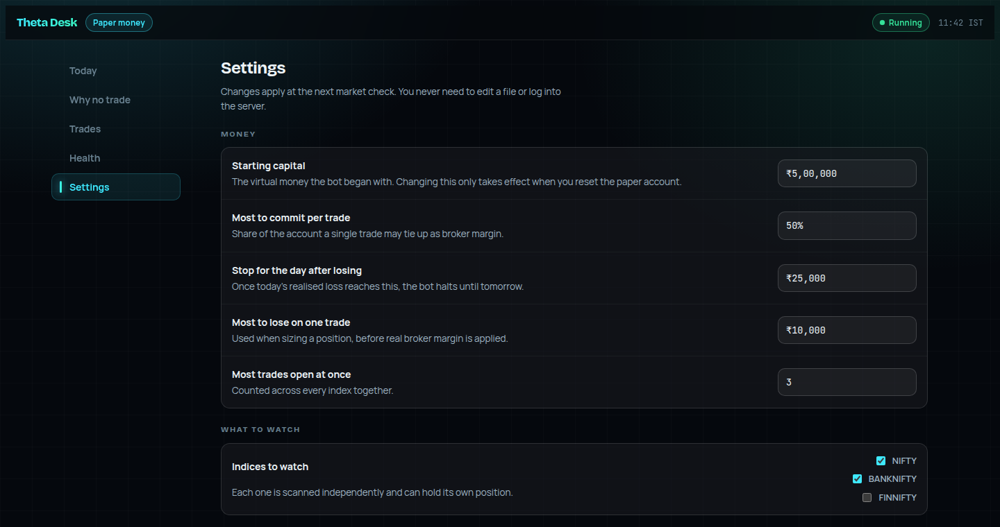
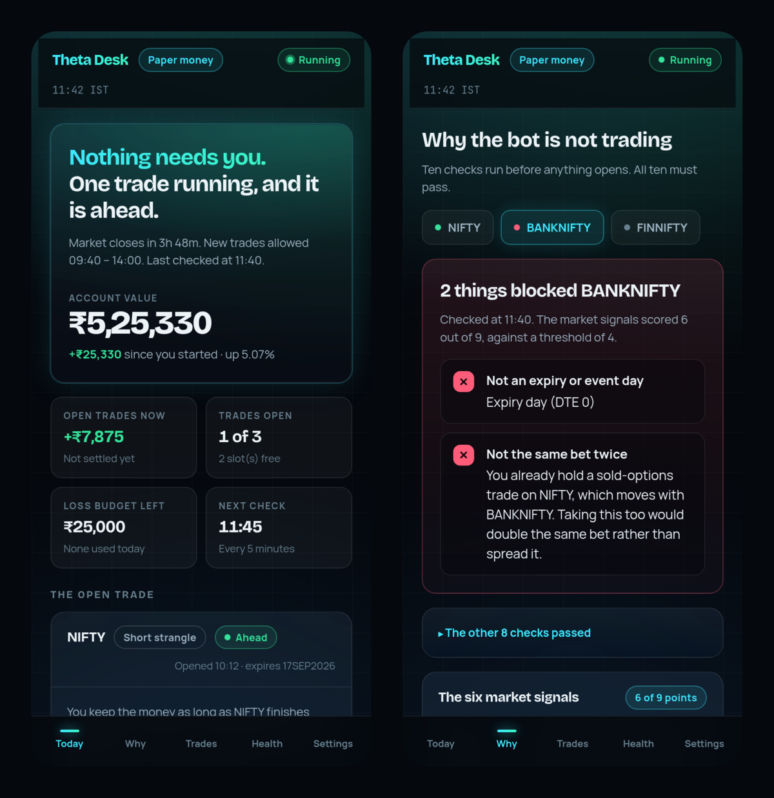
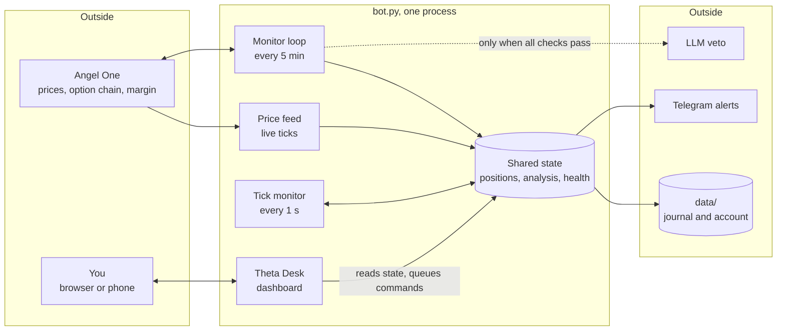
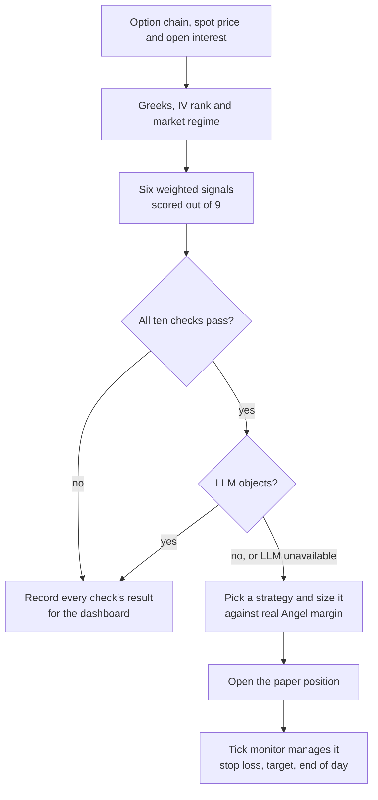

# NIFTY Options Trading Bot

An automated paper-trading bot for Indian index options on Angel One, with a live web dashboard called **Theta Desk**.

It scans NIFTY and BANKNIFTY every five minutes, decides in code whether a trade has a real edge, sizes it against the margin the broker would actually block, and manages every open position on live ticks until it hits its stop loss, its target, or the end of the day. An LLM is consulted once per trade, and only as a veto.

> [!IMPORTANT]
> **Paper trading only.** The bot places no real orders. It reads live prices and real margin from Angel One and simulates the fills. Nothing in this repository is financial advice.



<sub>Every screenshot in this README comes from the real dashboard running against sample data, not a live account.</sub>

## Contents

- [What it does](#what-it-does)
- [The dashboard](#the-dashboard)
- [How it works](#how-it-works)
- [Quick start](#quick-start)
- [Configuration](#configuration)
- [Project layout](#project-layout)
- [Testing and tools](#testing-and-tools)
- [Deployment](#deployment)
- [Safety](#safety)

## What it does

- **Scans every five minutes** during market hours. Each index gets a full read: the option chain and open interest, Greeks, IV rank, the market regime, and a technical read from RSI, MACD, EMA, Supertrend and VWAP.
- **Gates every entry in code.** Ten checks must all pass before anything opens. The LLM can object to a trade, but it can never force one.
- **Sizes against real margin.** Lot counts are capped by what Angel One's margin calculator says the legs would block.
- **Manages positions on live ticks.** A one-second loop watches each open position against its stop loss and target, and anything still open is closed before the market shuts.
- **Trades several indices at once**, holding at most one position per index and capping correlated short-premium bets.
- **Protects the day.** Hitting the daily loss limit halts new trades, and that halt survives a restart.
- **Explains itself.** The dashboard answers "why didn't it trade?" in plain English, and Telegram carries the alerts.

## The dashboard

Theta Desk runs inside the bot process. It is written for someone who does not trade for a living, so every screen leads with a sentence and puts the numbers underneath.

### Today

The first screen answers "does anything need me?" The open trade shows the price band where you keep the premium, where the index sits inside it, and how far the running profit is from each automatic exit.

Below that, two charts follow the session: the open trade's profit against its stop loss and target, and the index price against the band the trade needs it to stay in.

<p align="center"></p>

### Why no trade

A quiet day is not always a broken bot. This screen shows the latest verdict of all ten entry checks for each index, puts the failures first, and breaks down the six market signals behind the score.



### Trades

Account value over time, hit rate, profit per rupee lost, and every closed trade with the reason it closed.



### Health

Whether each moving part is alive: the broker login, the live price feed, the scan loop, the LLM, Telegram, and the history the bot needs before it may sell options on an index.



### Settings

Risk limits, which indices to watch, the entry window, blackout dates and how strict the gate is. All of it is editable while the bot runs and applies at the next scan, with no restart and no file to edit.



### On a phone

The layout collapses to a single column with a tab bar along the bottom.

<p align="center"></p>

### Controls

| Control | What happens |
|---|---|
| Stop taking new trades | Blocks new entries straight away, after a confirmation. Open positions keep being managed. |
| Start taking trades again | Refused while the daily loss limit is still breached. |
| Close this trade now | Needs a second tap. The close is queued and carried out by the tick loop within about a second. |
| Check the market now | Runs the full scan immediately instead of waiting for the next cycle. |

## How it works

Everything runs in one long-lived process. The dashboard lives in that process too, because open positions, live ticks and the gate's verdicts only exist in its memory. A separate service could only read the files on disk, and could not stop anything.



The web thread never changes a position itself. Pausing flips a single flag. Anything that opens or closes a trade is put on a command queue and carried out by the tick monitor, which already owns that state, so a manual close can never race an automatic one.

### From scan to trade

Every cycle takes each watched index through the same pipeline.



### The signals

Each signal only scores when it carries an edge. A reading in the ordinary middle of its range scores nothing.

| Signal | Scores when | Points |
|---|---|---|
| Put-call ratio | It sits at an extreme, above 1.2 or below 0.8 | 1 or 2 |
| Open interest | Spot is pressed against support or resistance | 1 |
| IV rank | Options are rich, 55 or above, or cheap, 30 or below, against their own history | 2 |
| India VIX | The market is very calm, below 12, or fearful, above 22 | 1 |
| Time decay | Two days or fewer remain to expiry | 1 |
| Technicals | Three or more of the indicators agree | 2 |

Until an index has ten days of recorded IV history, its IV rank falls back to India VIX's own percentile, and premium selling stays blocked if neither is available.

### The ten entry checks

| Check | Rule by default |
|---|---|
| Enough signals agree | A score of at least 4 out of 9 |
| One view clearly won | The leading view is ahead of the opposing one by 2 points or more |
| Options are pricey enough to sell | IV rank of 55 or more, for premium-selling trades only |
| Trading is switched on | Not paused by you, and not halted by the loss limit |
| Loss budget has room | Today's realised loss is inside the daily limit |
| A free slot | Fewer than 3 positions open across all indices |
| Inside trading hours | Between 09:40 and 14:00 |
| Not an expiry or event day | Not the index's expiry day, and not a configured event date |
| Cooling-off period is over | 30 minutes since the last exit on that index |
| Not the same bet twice | No other short-premium position across NIFTY, BANKNIFTY and FINNIFTY |

All ten are evaluated on every scan and stored in the journal, so the dashboard can show the whole picture rather than only the first failure.

### Strategies

Every trade is a list of legs, so profit and loss, stops and targets work the same way for every strategy. The code picks the strategy from the direction the signals lean. If the LLM suggests a valid strategy instead, that suggestion is used.

| Strategy | Legs | Used when the signals lean towards | Stop loss | Target |
|---|---|---|---|---|
| Short strangle | Sell an out-of-the-money call and put, strikes picked near 0.16 delta | Selling expensive options | 40% | 50% |
| Long straddle | Buy the at-the-money call and put | Buying cheap options | 40% | 60% |
| Bull call spread | Buy the at-the-money call, sell the next call up | The market rising | 50% | 80% |
| Bear put spread | Buy the at-the-money put, sell the next put down | The market falling | 50% | 80% |
| Short straddle | Sell the at-the-money call and put | An LLM suggestion | 40% | 50% |
| Long call, long put | Buy one at-the-money option | An LLM suggestion | 40% | 60% |

The stop loss and target are shares of the premium collected or paid. Within a day of expiry both tighten, the stop to 80% of its usual size and the target to 70%. Legs with open interest under 500 are skipped, and a sold position must collect at least 0.4% of the index price.

### A trading day

| Time, IST | What runs |
|---|---|
| 08:30 | Log in to Angel One, load the instrument list, start the price feed, restore any open positions |
| 08:45 | Pre-market snapshot of each index and India VIX |
| 09:30 | Opening scan of every watched index |
| 09:30 to 15:30 | The five-minute monitor cycle and the one-second tick monitor |
| 12:00 | Midday pulse |
| 14:30 to 15:00 | Anything still open is closed, so nothing is carried overnight |
| 15:30 | End-of-day report |

Scheduled jobs skip weekends. There is no exchange holiday calendar, so on a market holiday the jobs still run and simply find nothing to trade.

## Quick start

You need an Angel One SmartAPI account with TOTP enabled, a Telegram bot for alerts, and access to one LLM provider. The project is tested on Python 3.12.

Only the Anthropic client is installed by default. For OpenAI or Groq, uncomment its line in `requirements.txt` first. Gemini needs its client package installed separately, and Ollama needs no package at all.

```bash
git clone <your-repo-url> trading_bot
cd trading_bot
python3 -m venv venv
source venv/bin/activate
pip install -r requirements.txt
mkdir -p logs data

cp .env.development .env    # then fill in the Angel One, Telegram and LLM values
python bot.py
```

On start the bot logs in, runs the pre-market and opening scans straight away, and starts its loops. Then open the dashboard:

```bash
cat data/web_token.txt      # the access token, generated on first run
```

Browse to <http://127.0.0.1:8787> and paste the token.

## Configuration

Settings are read from `.env.${APP_ENV}` and then `.env`. [`.env.development`](.env.development) is a template listing every variable with no secrets in it.

Environment values are **defaults**. Anything you change on the dashboard's Settings screen is saved to `data/settings.json` and takes precedence. Setting a value back to its default removes the override.

| Variable | Default | Purpose |
|---|---|---|
| `ANGEL_API_KEY`, `ANGEL_CLIENT_ID`, `ANGEL_PASSWORD`, `ANGEL_TOTP_SECRET` | | Broker login |
| `TELEGRAM_BOT_TOKEN`, `TELEGRAM_CHAT_ID` | | Alerts |
| `LLM_PROVIDER` | `anthropic` | One of `anthropic`, `openai`, `groq`, `gemini`, `ollama` |
| `LLM_MODEL` | `claude-sonnet-4-20250514` | Model name for Anthropic, OpenAI, Groq or Gemini |
| `ANTHROPIC_API_KEY`, `OPENAI_API_KEY`, `GROQ_API_KEY`, `GEMENI_API_KEY` | | The key for your provider. The Gemini variable really is spelled `GEMENI` in the code |
| `OLLAMA_BASE_URL`, `OLLAMA_MODEL` | `http://localhost:11434`, `llama3` | Used instead of `LLM_MODEL` when the provider is `ollama` |
| `ACTIVE_INDICES` | `NIFTY,BANKNIFTY` | Indices to scan. `FINNIFTY` is also supported |
| `PAPER_CAPITAL` | `500000` | Virtual starting capital in rupees |
| `MAX_CAPITAL_PER_TRADE` | `0.5` | Share of capital one trade may tie up as margin |
| `MAX_DAILY_LOSS` | `-25000` | Realised loss that halts trading for the day |
| `MAX_PER_TRADE_LOSS` | `-10000` | Used when sizing a position |
| `MAX_OPEN_POSITIONS` | `3` | Across all indices |
| `ENTRY_WINDOW_START`, `ENTRY_WINDOW_END` | `09:40`, `14:00` | When new trades may open |
| `ENTRY_COOLDOWN_MIN` | `30` | Minutes before re-entering an index after an exit |
| `EXPIRY_BLACKOUT_DTE` | `0` | Block entries at or below this many days to expiry |
| `EVENT_BLACKOUT_DATES` | | Comma-separated ISO dates, such as budget day or RBI policy |
| `ENTRY_THRESHOLD` | `4` | Signal points needed, out of 9 |
| `IV_RANK_SELL`, `IV_RANK_BUY` | `55`, `30` | IV rank levels for selling and buying premium |
| `IV_MIN_HISTORY` | `10` | Days of IV history before an index's own IV rank is trusted |
| `MIN_LEG_OI`, `MIN_CREDIT_PCT` | `500`, `0.004` | Liquidity and minimum-premium filters |
| `STRANGLE_TARGET_DELTA` | `0.16` | How far out of the money strangle legs sit |
| `TELEGRAM_ENABLED` | `1` | Set `0` to keep alerts in the dashboard only |
| `WEB_UI_ENABLED` | `1` | Set `0` to run without the dashboard |
| `WEB_UI_HOST`, `WEB_UI_PORT` | `127.0.0.1`, `8787` | Dashboard bind address |
| `WEB_UI_TOKEN` | generated | Leave blank to have one written to `data/web_token.txt` |
| `WEB_UI_AUTH` | `on` | `off` removes the login, which only makes sense on a private bind |

### What lives in `data/`

| File | Holds |
|---|---|
| `trade_journal.db` | SQLite journal of trades, every scan's signals, events, gate verdicts and daily equity |
| `paper_state.json` | The paper account: capital, closed trades and open positions |
| `settings.json` | Settings changed from the dashboard |
| `risk_state.json` | Today's trading halt, if there is one |
| `iv_history.json` | Daily implied volatility per index, for IV rank |
| `web_token.txt` | The dashboard access token, readable only by its owner |
| `event_blackout.json` | Optional list of event dates to block |

The whole directory is git-ignored.

## Project layout

```text
bot.py                   Entry point: login, background threads, daily schedule
config/settings.py       Env-driven defaults, instruments and risk rules
utils/
  angel_helper.py        Angel One login, prices and real margin
  options_helper.py      Instrument list, option chain, open interest, PCR, max pain
  greeks_engine.py       Black-Scholes, Greeks, implied volatility, IV rank
  technical.py           RSI, MACD, EMA, Supertrend, VWAP
  regime_detector.py     Market regime
  iv_history.py          Per-index IV history
  index_scanner.py       The per-index analysis pipeline
  signal_engine.py       Weighted signals and the ten-check entry gate
  llm_brain.py           The LLM veto, across five providers
  strategies.py          Leg-based strategies, pricing and profit and loss
  risk_manager.py        Sizing, loss limits and the persistent halt
  paper_trader.py        Simulated fills and the saved paper account
  monitor.py             The five-minute cycle
  tick_monitor.py        The one-second loop: stops, targets, dashboard commands
  websocket_feed.py      Live price stream
  event_calendar.py      Expiry and event blackouts
  scheduler.py           Daily jobs
  trade_journal.py       The SQLite journal
  events.py              Event bus to the journal, dashboard and Telegram
  settings_store.py      Settings that can change while the bot runs
  control.py             Command queue from the dashboard
  runtime.py             Health and intraday chart data
  telegram_helper.py     Telegram delivery
  backtester.py          Backtest report
web/
  server.py              FastAPI app, login, runs on a background thread
  api.py                 JSON API and the live event stream
  serializers.py         Bot state turned into plain-English JSON
  auth.py                Token login
  static/index.html      The dashboard
tests/                   Test suite, no broker or network needed
run_backtest.py          30-day backtest report
view_journal.py          Today's signals and weekly P&L in the terminal
DEPLOY.md                Deployment guide
```

## Testing and tools

```bash
python -m pytest          # 107 tests
python run_backtest.py    # 30-day backtest report from the journal
python view_journal.py    # today's signals and the weekly summary
```

The tests need no broker, network or Telegram. Each one runs against its own temporary journal, settings file and account state.

<details>
<summary>Dashboard API</summary>

Every endpoint except `/healthz` and the login needs the token, sent either as the session cookie set by `/api/login` or as `Authorization: Bearer <token>`.

| Method | Path | Does |
|---|---|---|
| `GET` | `/api/state` | Everything the Today, Why no trade and Health screens show |
| `GET` | `/api/stream` | Server-sent events: activity as it happens, plus fresh state |
| `GET` | `/api/trades` | Closed trades, the equity curve and daily profit |
| `GET` | `/api/health` | Health checks on their own |
| `GET` | `/api/events` | The event log |
| `GET`, `POST` | `/api/settings` | Read settings, or apply changes and get back any errors |
| `POST` | `/api/settings/reset` | Return every setting to its default |
| `POST` | `/api/control/pause`, `/api/control/resume` | Stop or restart new entries |
| `POST` | `/api/control/close` | Queue a close, with a body of `{"index": "NIFTY"}` |
| `POST` | `/api/control/close-all`, `/api/control/rescan` | Close everything, or scan now |
| `GET` | `/api/control/result/{id}` | The outcome of a queued command |

</details>

## Deployment

The bot is a long-running, stateful process with background threads, so it belongs on a VM under systemd rather than a serverless platform. [DEPLOY.md](DEPLOY.md) walks through a Google Compute Engine setup in the Mumbai region, the service file, reaching the dashboard safely, and backups.

## Safety

- **No real orders.** Live order placement has not been built. Before it is, fills, slippage and partial fills would all need modelling and verifying.
- **Keep the dashboard private.** It can close positions. It binds to loopback by default and requires a token. Reach it over Tailscale or an SSH tunnel as described in [DEPLOY.md](DEPLOY.md), and never open its port to the internet.
- **Secrets stay out of git.** `.env` and everything in `data/` are ignored.
- **The daily halt is durable.** It is saved with the date, so a crash or restart cannot clear it, and each new day still starts clean.
- **The LLM fails open.** If the LLM is unreachable, a trade that passed all ten checks still goes ahead. The code gate, not the LLM, is the safety net.
- **Calibrate before trusting it.** The signal weights and thresholds are reasoned defaults, not fitted parameters. Let it run on paper for several weeks and check the results before drawing conclusions.
